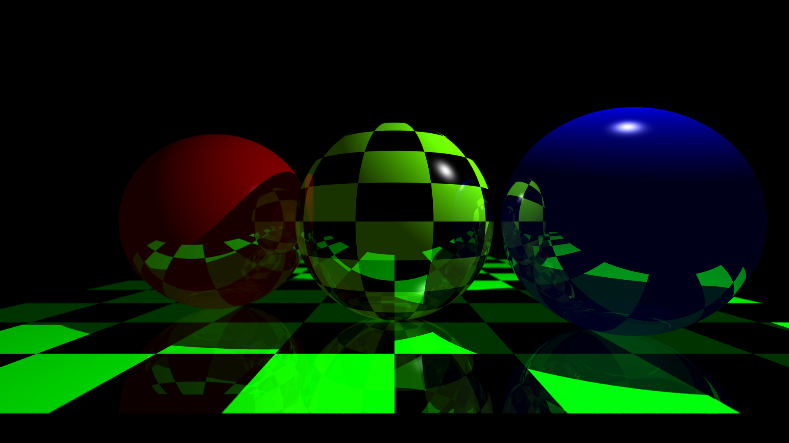

# ILM Ray Tracing

## Building

GCC or Clang with C++17 support is required to build this project.

It is reccomended that you use the build script [`build.sh`](./build.sh), because it adds to the compiler **include path** the following vendored dependencies:

- GLM

If you want to **run the build command by hand**, make sure to pass the following flags:

`-isystem vendor -std=c++17`

to the compiler.

## Demo

